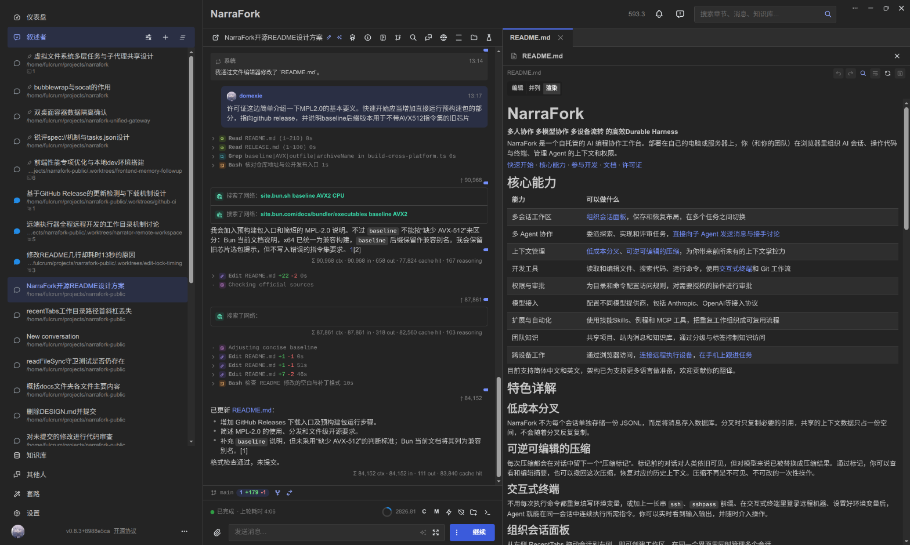
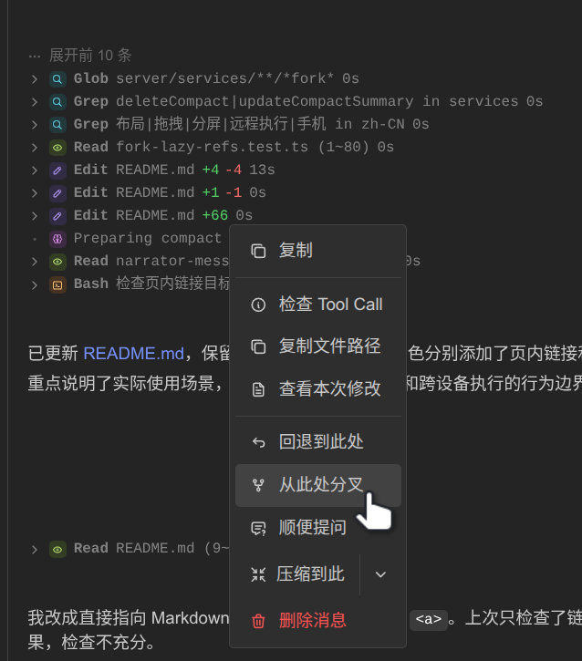
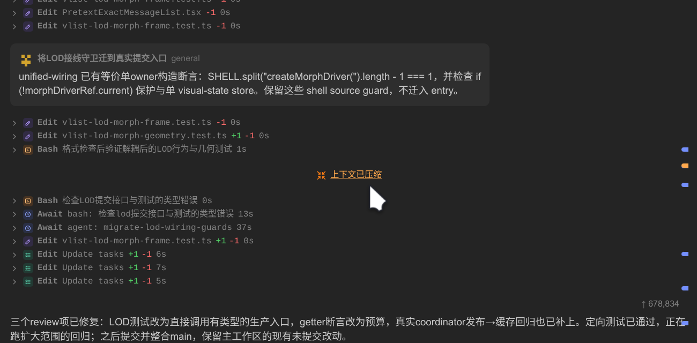
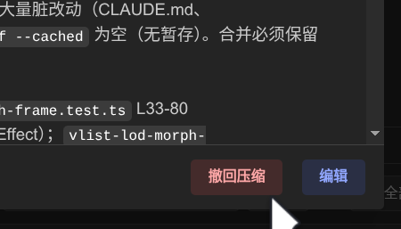
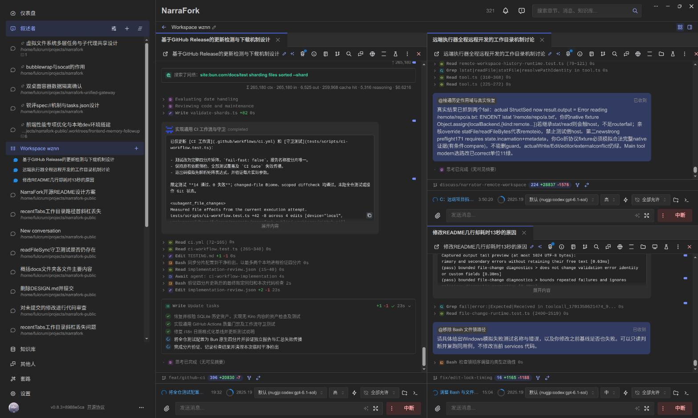
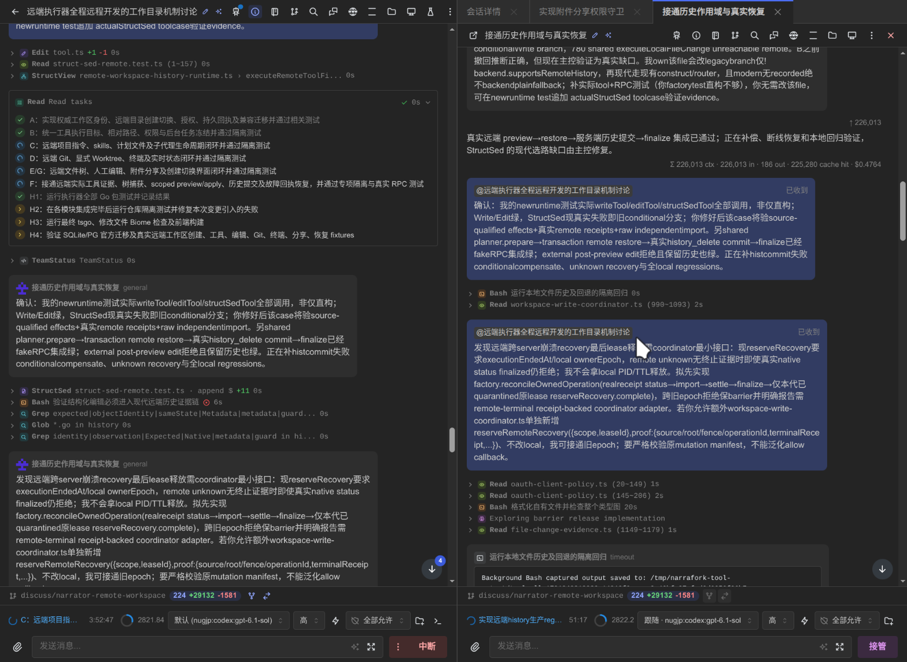
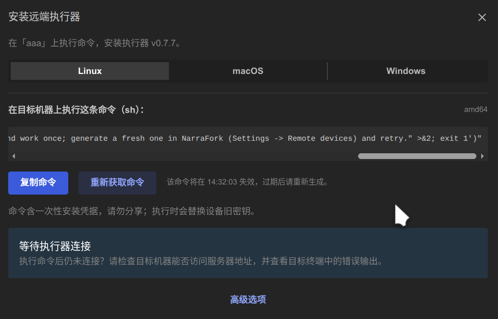
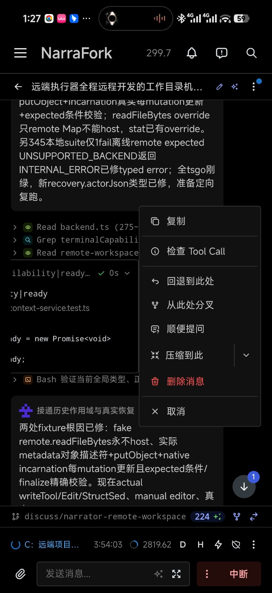

# NarraFork

**多人协作 多模型协作 多设备流转 的高效Durable Harness**

NarraFork 是一个自托管的 AI 编程协作工作台。部署在自己的电脑或服务器上，你（和你的团队）在浏览器里组织 AI 会话、操作代码与终端、管理 Agent 的上下文和权限。

[快速开始](#快速开始) · [核心能力](#核心能力) · [参与开发](#参与开发) · [文档](#文档) · [许可证](#许可证)



## 核心能力

| 能力 | 可以做什么 |
| --- | --- |
| 多会话工作区 | [组织会话面板](#组织会话面板)，保存和恢复布局，在多个任务之间切换 |
| 多 Agent 协作 | 委派探索、实现和评审任务，[直接向子 Agent 发送消息与接手讨论](#向子-agent-发送消息与接手讨论) |
| 上下文管理 | [低成本分叉](#低成本分叉)、[可逆可编辑的压缩](#可逆可编辑的压缩)，为你带来前所未有的上下文掌控力 |
| 开发工具 | 读取和编辑文件、搜索代码、运行命令，使用[交互式终端](#交互式终端)和 Git 工作流 |
| 权限与审批 | 为目录和命令配置访问规则，对需要授权的操作进行审批 |
| 模型接入 | 配置不同模型提供商，包括 Anthropic、OpenAI等接入协议 |
| 扩展与自动化 | 使用技能Skills、例程和 MCP 工具，把重复工作组织成可复用流程 |
| 团队知识 | 共享项目、站内消息和知识库，通过分级与标签控制知识访问 |
| 跨设备工作 | 通过浏览器访问，[连接远程执行设备](#连接远程执行设备)，[在手机上跟进任务](#在手机上跟进任务) |

目前支持简体中文和英文，架构已为支持更多语言做准备，欢迎贡献你的翻译。

## 特色详解

### 低成本分叉



NarraFork 不为每个会话单独存储一份 JSONL，而是将消息存入数据库。分叉时只复制必要的引用，共享的上下文数据只占一份空间，不会随着分叉反复复制。

### 可逆可编辑的压缩

每次压缩都会在对话中留下一个“压缩标记”。标记前的对话对人类依旧可见，但对模型来说已被替换成压缩结果。通过标记，你可以查看和编辑摘要，也可以撤回这次压缩，恢复对应的历史上下文。压缩不再是不可见、不可改的一次性操作。





### 交互式终端

不用每次执行命令都重复填写环境变量，或加上一长串 `ssh`、`sshpass` 前缀。在交互式终端里登录远程机器、设置好环境变量后，Agent 就能在同一会话中连续执行所需指令。你可以实时看到输入输出，并随时介入操作。

### 组织会话面板

从左侧 RecentTabs 拖动会话到右侧，即可创建工作区，在同一个界面里同时管理多个会话。



### 向子 Agent 发送消息与接手讨论

你可以直接点开子 Agent 的会话，向它发送消息、补充要求，或接手继续讨论，无需经过主 Agent 转达。



### 连接远程执行设备



连接你的电脑或服务器，让 Agent 直接在指定机器上读写文件、运行命令，无需来回切换工作台。

### 在手机上跟进任务



手机不是临时凑合的入口，而是 NarraFork 的日常使用方式。我们为手机专门设计了交互，例如左滑会话消息即可打开操作菜单，让丰富的会话操作在小屏幕上依然触手可及，而不只是查看进度。

## 快速开始

### 直接运行预构建包

前往 [GitHub Releases](https://github.com/NarraFork/narrafork/releases)，在对应版本的 Assets 中下载适合操作系统和 CPU 架构的可执行文件，无需安装 Bun 或自行构建。项目与版本管理仍需安装 Git。

- **Windows**：下载 `.exe` 文件后直接运行。
- **Linux / macOS**：为下载的文件添加执行权限后运行，例如：

  ```sh
  chmod +x ./narrafork-<版本>-<平台>-<架构>
  ./narrafork-<版本>-<平台>-<架构>
  ```

  请将示例文件名替换为实际下载的文件名。

旧款 x64 芯片可选择带 `baseline` 后缀的兼容版本。注意：这并非以 AVX-512 支持与否为界；按 [Bun 当前说明](https://bun.com/docs/bundler/executables)，x64 构建已统一，`baseline` 保留为兼容别名。具体以该版本发布说明为准。

启动后打开 `http://localhost:7778`；实际地址以启动日志为准。

### 从源码运行

下载本仓库源码，并在仓库根目录打开终端。

#### 准备环境

- **Bun**：建议使用与 [package.json](package.json) 中 `packageManager` 一致的版本。
- **Git**：用于项目和版本管理。
- **模型接入凭据**：根据你选择的提供商准备 API Key 或相应授权。NarraFork 不附带模型服务额度。

#### 安装并运行

```sh
bun install --frozen-lockfile
bun run build
bun run start
```

启动过程会执行数据库迁移，再启动服务。默认访问地址为 `http://localhost:7778`；如果修改了端口，以启动日志为准。

### 完成第一次任务

1. 打开页面并注册账号；首个注册用户成为管理员。
2. 在设置中配置模型提供商和可用模型。
3. 创建一个绑定本地 Git 仓库的项目，或从工作目录开始创建会话。
4. 选择模型，向 AI 描述任务。NarraFork 中的 AI 会话称为“叙述者（Narrator）”。
5. 查看文件改动与工具执行结果；遇到权限请求时，核对操作后再批准。

可以从一个小任务开始，例如：“阅读这个仓库，解释入口文件和主要模块，先不要修改代码。”

### 数据与访问边界

- 默认数据目录为 `~/.narrafork/`，其中包含数据库和配置；请妥善备份并保护访问权限。
- 默认监听 `localhost`，仅供本机访问。手机或其他成员访问前，需要配置监听地址和网络访问方式。
- **自托管不等于模型推理全部在本地。** 使用外部模型或工具服务时，请求所需的对话、代码或工具结果可能发送到对应服务。
- **Agent 可以实际修改文件和执行命令。** 权限审批不等同于操作系统沙箱；请使用适当的系统账号和工作目录，并检查生成的改动。
- 对外开放服务前，请先完成管理员初始化，配置 HTTPS 与访问控制；不要把未经配置的实例直接暴露到公网。

## 参与开发

安装依赖后，启动开发环境：

```sh
bun run dev:all
```

该命令会执行迁移，并同时启动后端和前端开发服务器。默认前端端口为 `7778`，后端端口为 `7779`。

常用检查：

```sh
# 代码风格与静态检查
bunx @biomejs/biome check .

# TypeScript 类型检查
bunx tsgo --noEmit

# 隔离运行测试
bun run test
```

只运行部分测试时，同样使用隔离模式：`bun test --isolate <测试文件路径>`。测试约定见 [测试说明](docs/TESTING.md)。

### 仓库结构

```text
frontend/         React 前端、工作区界面与浏览器交互
server/           HTTP / WebSocket 服务、Agent 框架与业务逻辑
shared/           前后端共享类型与协议
remote-executor/  远程执行设备
vscode-extension/ VS Code 扩展
scripts/          开发、构建与发布脚本
```

主要技术栈：Bun、TypeScript、React、Mantine、Hono、Drizzle ORM，以及默认的 SQLite 存储。

### 贡献方式

欢迎通过 Issue 提交问题、复现步骤和使用反馈，也欢迎通过 Pull Request 改进代码、测试、翻译和文档。

- 较大的功能或架构改动，请先通过 Issue 讨论范围与方案。
- 修复问题时，尽可能提供可复现步骤和相关测试。
- 修改界面文案时，请同步更新英文和简体中文翻译。
- 提交日志、截图或复现材料前，请移除 API Key、访问令牌及其他敏感信息。
- 贡献合并前需完成 [贡献者许可协议（CLA）](CLA.md) 中的签署与确认流程；请先阅读完整协议。

## 文档

- [测试说明](docs/TESTING.md)
- [知识库与权限模型](docs/KNOWLEDGE_BASE.md)
- [OAuth 与 External API](docs/OPEN_API.md)
- [VS Code 扩展](docs/VSCODE_EXTENSION.md)
- [模型提供商实现说明](docs/AGENT_PROVIDERS.md)
- [第三方许可证说明](docs/LICENSES.md)

## 许可证

NarraFork 使用 [Mozilla Public License 2.0（MPL-2.0）](LICENSE)，这是一种**文件级弱 copyleft** 许可证：

- 允许使用、修改和商业使用。
- 对外分发时，MPL 覆盖的文件及其修改须继续按 MPL 提供源码，并保留许可与版权声明。
- 可以与采用其他许可证的独立文件组合，不要求整个项目都改用 MPL。
- 仅内部使用或修改、不对外分发时，无需公开修改后的源码。

以上为简要说明，具体以许可证全文为准。第三方组件遵循各自的许可证；贡献者协议见 [CLA.md](CLA.md)。